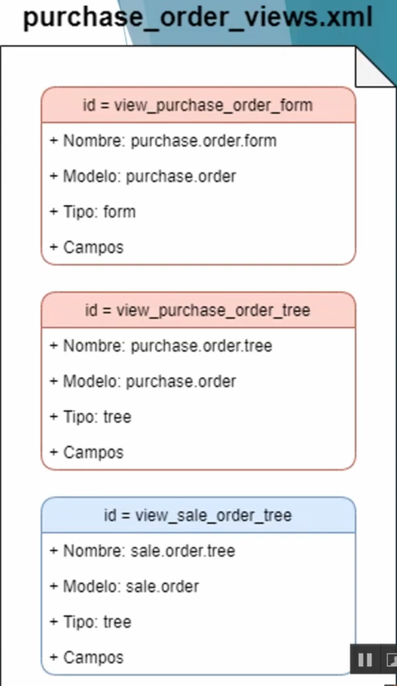
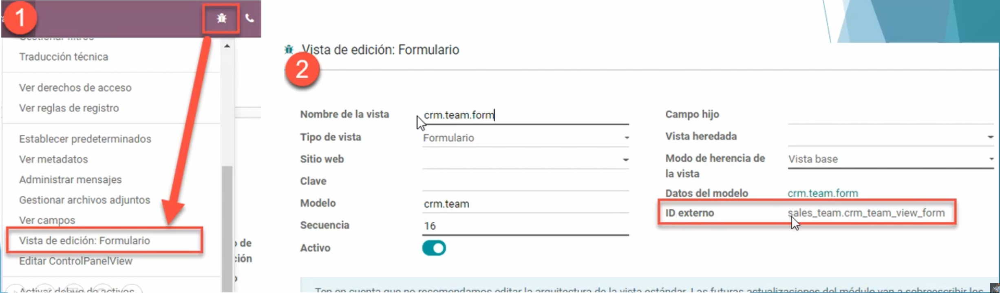
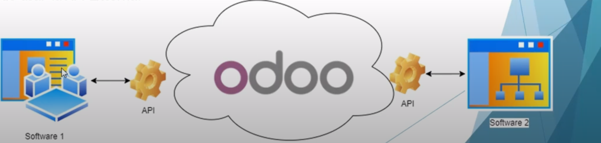
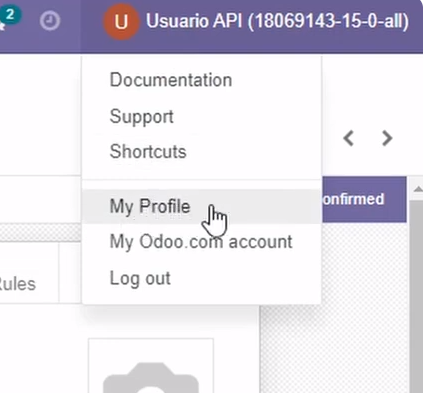
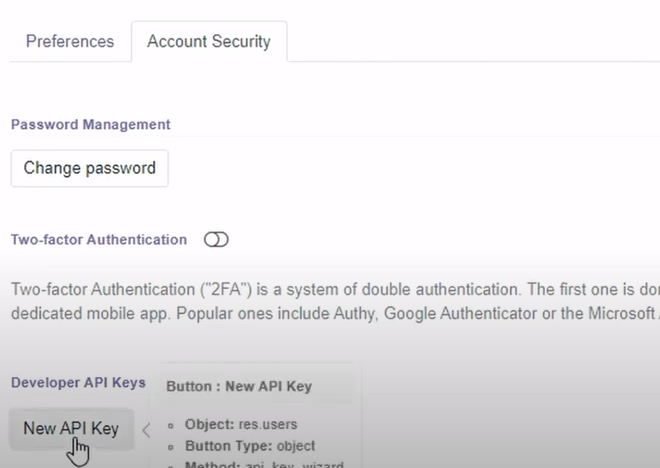
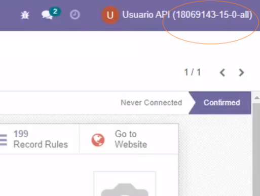
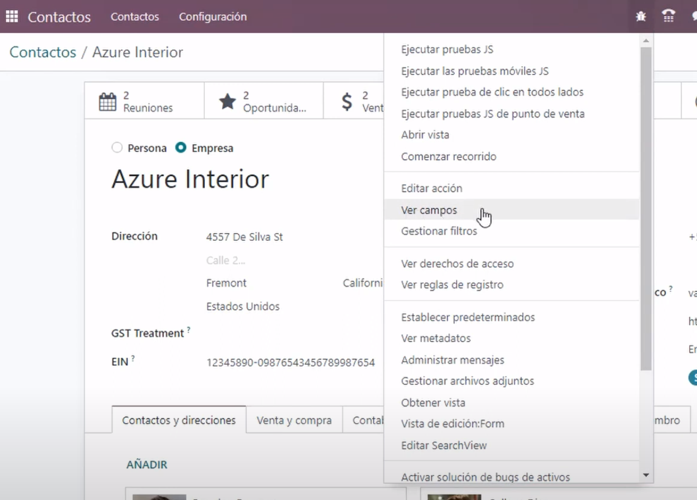

# Módulo template Odoo - por [@xXcarlos117Xx2](https://github.com/xXcarlos117Xx2)
## Introducción

El objetivo de este template es tener un documento en Español para ayudarnos a realizar los módulos en Odoo de una manera rápida, o al menos tener una referencia donde mirar que hace cada archivo, para que sirve, como se comporta, que es posible con ese módulo.

Este módulo esta orientado a desarolladores Junior que desean empezar en Odoo pero no tienen ni idea de por donde empezar. Recomiendo echarle una lectura al menos a la [documentacion oficial](https://www.odoo.com/documentation/master/) primero y/o ver [algun video en youtube sobre cursos de programación en Odoo](https://www.youtube.com/playlist?list=PLXwzJRuH--eYHB3OD2wATjzJ83UAp2WQs) para empezar a entender primero que es Odoo y las bases de este.

En concreto este tutorial/template tiene ejemplos y texto extraido de [esta lista de reproducción](https://www.youtube.com/playlist?list=PLXwzJRuH--eYHB3OD2wATjzJ83UAp2WQs) del creador de contenido [Josuhe Uh](https://www.youtube.com/@jos.uh.e)

## Estructura de un módulo en Odoo

```bash
test_addon/
├── __init__.py # Archivo para inicializar el módulo y los submódulos.
├── __manifest__.py # Archivo de configuración del módulo como nombre, versión, dependencias, etc.
│
├── controllers/ # Carpeta que contiene los controladores Python para manejar las rutas HTTP.
│   ├── __init__.py
│   └── main.py
│
├── data/ # Carpeta para archivos de datos, como datos iniciales o de configuración.
│   ├── data_file.xml
│   └── demo_data.xml
│
├── demo/ # Carpeta para datos de demostración que se cargan en la base de datos de demostración.
│   └── demo.xml
│
├── models/ # Carpeta que contiene los modelos de datos definidos en Python.
│   ├── __init__.py
│   └── test_addon_model.py
│
├── security/ # Carpeta para archivos de seguridad, como reglas de acceso y permisos.
│   ├── ir.model.access.csv
│   └── security.xml
│
├── static/ # Carpeta para archivos estáticos, como imágenes, CSS y JavaScript.
│   ├── description/
│   │   └── icon.png #Icono del módulo.
│   └── src/
│       ├── css/
│       │   └── styles.css
│       ├── img/
│       │   └── image.png
│       └── js/
│           └── script.js
│
├── views/ # Carpeta para archivos de vistas definidos en XML.
│   ├── test_addon_view.xml
│   ├── test_addon_search_view.xml
│   ├── ...
│
└── wizards/ # Carpeta para asistentes (wizards) definidos en Python.
    ├── __init__.py
    └── test_addon_wizard.py
```

### Explicación de la estructura

- **`__init__.py`**: Archivo para inicializar el módulo y los submódulos.
- **`__manifest__.py`**: Archivo de configuración del módulo, contiene metadatos como nombre, versión, dependencias, etc.
- **`controllers/`**: Carpeta que contiene los controladores Python para manejar las rutas HTTP.
  - `__init__.py`: Inicializa el submódulo de controladores.
  - `main.py`: Archivo de controladores donde defines las rutas y lógica del backend.
- **`data/`**: Carpeta para archivos de datos, como datos iniciales o de configuración.
  - `data_file.xml`: Archivo de datos.
  - `demo_data.xml`: Archivo de datos de demostración.
- **`demo/`**: Carpeta para datos de demostración que se cargan en la base de datos de demostración.
  - `demo.xml`: Archivo de datos de demostración.
- **`models/`**: Carpeta que contiene los modelos de datos definidos en Python.
  - `__init__.py`: Inicializa el submódulo de modelos.
  - `test_addon_model.py`: Archivo donde defines los modelos de datos.
- **`security/`**: Carpeta para archivos de seguridad, como reglas de acceso y permisos.
  - `ir.model.access.csv`: Archivo CSV que define los permisos de acceso a los modelos.
  - `security.xml`: Archivo XML para definir reglas de seguridad.
- **`static/`**: Carpeta para archivos estáticos, como imágenes, CSS y JavaScript.
  - `description/`: Carpeta para archivos de descripción, como el icono del módulo.
    - `icon.png`: Icono del módulo.
  - `src/`: Carpeta para recursos fuente.
    - `css/`: Carpeta para archivos CSS.
      - `styles.css`: Archivo CSS.
    - `img/`: Carpeta para imágenes.
      - `image.png`: Imagen de ejemplo.
    - `js/`: Carpeta para archivos JavaScript.
      - `script.js`: Archivo JavaScript.
- **`views/`**: Carpeta para archivos de vistas definidos en XML.
  - `test_addon_view.xml`: Vista de formulario y lista.
  - `test_addon_search_view.xml`: Vista de búsqueda.<br>
  - ...
- **`wizards/`**: Carpeta para asistentes (wizards) definidos en Python.
  - `__init__.py`: Inicializa el submódulo de asistentes.
  - `test_addon_wizard.py`: Archivo donde defines los asistentes.

## Consideraciones al crear archivos XML en Odoo
- El nombre del archivo debe ser en **minúscula**. Por ejemplo: `purchase_order_views.xml`
- El nombre del archivo debe iniciar con el nombre del modelo, sustituir los puntos del nombre del modelo con guiones bajos `_`.
- El nombre del archivo debe terminar con `_views`.
- Un modelo puede tener varias vistas, que son diferentes maneras de mostrar los datos
- En un mismo archivo pueden existir varias vistas
- Odoo **no va a marcar error** al tener vistas de modelos diferentes en el mismo XML, sin embargo se recomienda tener vistas del mismo modelo en un único XML 
- Sobre el mismo XML se deberia declarar todas las vistas, acciones y menús relacionados al mismo modelo.
- Se deberia declarar en el siguiente orden:
  - Vistas
  - Acciopnes de venta
  - Acciones del servidor
  - Menús

### Ejemplo
<div style="display:flex;justify-content:center;"></div>

## Herencias en Odoo
El código base de Odoo **nunca** debería de modificarse.

En lugar de sobreescribir las vistas o modelos existentes para agregar eliminar o modificar funcionalidades existentes, deberemos de usar **herencias**. Estas modificaciones pueden ser a nivel de modelo, vista o lógica de negocio.<br>
En el archivo `__manifest__.py` en la sección `depends` se deberá indicar los módulos o aplicaciones que se heredan.<br>

## Herencias de **modelo y método**
### Como heredar un modelo
Para heredar un modelo, en **la clase** del archivo que queramos hacer que herede, sustituimos la palabra reservada `_name` por `_inhert` doonde pondremos el nombre del modelo ya existente.

### Cosas que podemos lograr heredando **de un modelo existente**:
- Agregar campos nuevos
- Anular la definición de campos
- Agregar restricciones o funcionalidades adicionales
- Agregar métodos y funcionalidades nuevas
- Anular métodos o procesos

### Herencia de métodos en los modelos
- **Una vez en un modelo heredado** se puede sobreescribir por completo un método.
- Para sobreescribir un método basta con agregar el nombre del método con la misma cantidad de parametros que el método original.
- Dentro del método se puede invocar a la funcionalidad original hablando al método de la super clase. Para ello se utiliza `super(NombreClase, self).método_original()`
```python
from odoo import models, fields, api

class NombreClase(models.Model):
    _inherit = 'modelo.a.heredar'

    campo_adicional = fields.Char()

    # Método original en el modelo heredado 'modelo.a.heredar'
    def metodo_original(self):
        # Agregar aquí funcionalidad adicional si así es requerido
        
        # Invocar a método original de la super clase 'modelo.a.heredar'
        res = super(NombreClase, self).metodo_original()
        
        # Agregar aquí funcionalidad adicional si así es requerido

        return res

```
<br>

- El método modificado debería de retornar siempre el mismo tipo de dato del método original.

## Herencia en **vistas XML**
### Como heredar una vista
<br>
Para heredar una vista, se agrega el tag `inherit_id` donde se indica el `id` de la vista que se desea heredar. Por ejemplo:

```xml
<field name="inherit_id" ref="id_de_vista_a_heredar" />
```
Para obtener el `id` de la vista que se desea heredar se activa el modo debug, en la vista que se desea heredar y se selecciona el menú **Vista de edición**
Se abrirá un *modal* del cual podemos ver nuestro `id` en el campo
<div style="display:flex;justify-content:center;"></div>
<br>
Dentro de la sección `arch` se puede colocar tantos tag `xpath` como se deseen
Los elementos `xpath` permite seleccionar y alterar contenido de la vista padre
En el atributo `expr` del tag `xpath` se selecciona el elemento de la vista. Este debe exitir, de lo contrario marcará <span style="color:red;">error</span>

### Ejemplos
<br>
Para localizar un elemento `xpath` declarado como 

```xml
<field name="descripción" />
```
<br>
se usa:

```xml
//field[@name='descripcion']
```
<br>
Para localizar un elemento `xpath` declarado como 

```xml
<button name="button_confirm" type="object" string="Confirm Order" id="draft_confirm" />
```
<br>
se usa:

```xml
//button[@id='draft_confirm']
```

[Explicación en video de](https://youtu.be/2Z0LMc90PCM?feature=shared&t=432) [Josuhe Uh](https://www.youtube.com/@jos.uh.e)

En el **atributo** `position` es la operación que se aplica al elemento encontrado. Puede tener diferentes valores:
- `Inside` -> Dentro del elemento encontrado.
- `Replace` -> Reemplaza el elemento por el que se especifique.
- `Before` -> Colocará el nuevo elemento **antes** que el elemento encontrado.
- `After` -> Colocará el nuevo elemento **después** de el elemento encontrado.
- `Attributes` -> Modificará los atributos del elemento encontrado.
<br>
<br>
```xml
<odoo>
    <data>
        <!-- heredar y agregar campo en vista form -->
        <record id="view_order_form_inherit" model="ir.ui.view">
            <field name="name">nombre.modelo.lo.heredita</field>
            <field name="model">nombre.modelo.a.hereditar</field>
            <field name="inherit_id" ref="module.nombre_vista_a_hereder"/>
            <field name="arch" type="xml">
                <!-- Busca el campo descripcion y agrega campo nuevo posicionandolo despues del campo descripcion -->
                <xpath expr="//field[@name='descripcion']" position="after">
                    <field name="campo_nuevo" string="Campo nuevo"/>
                </xpath>
            </field>
        </record>
    </data>
</odoo>
```
>En este ejemplo, lo que se realiza es colocar un nuevo campo despues del campo descripción.

# Constrains

Sirve para evitar que los usuarios ingresen datos incorrectos.
Restricciones comunes:
- Prevenir campos vacíos.
- Prevenir ciertos valores en campos: numéricos o cadenas...
- Restringir que solo se puedan introducir ciertos valores en un campo
- Prevenir que se repitan valores en ciertos campos.

Usando restricciones podemos evitar prevenir ciertas inconsistencias de datos en nuestro modelo.

Odoo nos permite **2 vias** para utilizar los **constrains**:
- A través de SQL 
- A través de Python **(Más comunes)**

## SQL Constrains
Las restricciones de SQL se definen mediante el atributo del modelo `_sql_constrains`

Para declarar correctamente el atributo `_sql_constrains` se debe usar una lista de **3** valores **de tipo cadena**. Los argumentos son:
- name
  - Es el nombre de la restricción. Debe ser minúscula y separado por guiones bajos

- sql_definition
  - es una expresión válida de **PostgreSQL**: `UNIQUE`, `CHECK` o `NOT NULL`

- message
  - Es el mensaje de error que se mostrará al dar el error

### Estructura básica
```python
_sql_constrains = [
  ('check_percentage', 'CHECK(percentage >= 0 AND percentage <= 100)', 'The percentage of an analytic distribution should be between 0 and 100')
]
```

### Ejemplo de SQL Constrains con mas de una restricción

```python
from odoo import models, fields, api

class TaskClassification(models.Model):
    _name = 'task.classification'
    _description = 'Clasificación por tipo de tarea'

    name = fields.Char(string='Nombre')
    number = fields.Integer(string='Número')

    _sql_constraints = [ #Las restricciones se incluyen en el mismo "_sql_constrains" aunque tengas varias
        ('name_not_null', 'CHECK(name IS NOT NULL)', 'El nombre no puede estar vacío'),
        ('no_number_negative', 'CHECK(number >= 0)', 'El número esperado debe ser positivo.'),
        ('name_uniq', 'UNIQUE(name)', "El nombre de la clasificación ya existe."),
    ]
```
<br>

Los tipos de restricción en Odoo se pueden ver de dos maneras:
- **f** -> *Restricciones de llave foránea*
- **u** -> *Otras restricciones*

Por defecto, Odoo siempre va a crear 2 restricciones SQL.
- nombre_modelo_**create_uid_fkey**
- nombre_modelo_**write_uid_fkey**

Creando las restricciones desde la interfaz de Odoo no suele respetarlas. Así que hay que intentar crearlas en el propio módulo

## Python Constrains
Las restricciones de Python se declaran mediante un método vacío, se deberá usar el decorador **@api.constrains**.<br>
En este decorador se definen los campos que se involucran en la restricción, la cual se evalúa automáticamente cuando se modifica cualquiera de estos campos.<br>
Se espera que el método genere una excepción llamada `ValidationError` si alguna validación falla.<br>

El decorador **@constrains** solo admite nombres de campos simples, los nombres con puntos (campos relacionales, por ejemplo `parter_id.customer`) no son compatibles y se ignorarán.

### Ejemplos de declaración de Costrains en Python

#### Como declarar un constrain en general:
```python
from odoo.exceptions import ValidationError

# Resto del módulo...

@api.constrains('date_end')
def _check_date_end(self):
    for record in self:
        if record.date_end < fields.Date.today():
            raise ValidationError("The end date cannot be set in the past")
# Si todos los registros son correctos asi que no se retorna nada
```

#### Ejemplo de un constrain:
```python
from odoo import models, fields, api
from odoo.exceptions import ValidationError

class TaskClassification(models.Model):
    _name = 'task.classification'
    description = 'Clasificación por tipo de tarea'
    
    name = fields.Char(string='Nombre')
    number = fields.Integer(string='Número')

    @api.constrains('name')
    def _check_unique_name(self):
        # Validar que el campo nombre no se repita.
        # Este método verifica si el nombre que se intenta poner es igual a la lista de
        # nombres del modelo 'task.classification'. Si es así, manda un alerta.
        # :raise ValidationError en caso de existir nombres repetidos
        task_classification = self.env['task.classification'].search([('id', '!=', self.id)])
        for record in self:
            for classification in task_classification:
                if classification.name.lower() == record.name.lower():
                    raise ValidationError("El nombre de la clasificación ya existe.")
      # Si todos los registros son correctos asi que no se retorna nada
```

---
<!-- Hay que mirar donde poner todo esto -->
---

### Método para descargar un archivo
Para descargar un archivo mediante python podemos utlizar el siguiente método: 
Tendremos que introcucir la esta URL: 
  URL/web/content/?model=ir.attachment&id=ID_IR_ATTACHMENT&filename_field=name&field=datas&download=true&name=NOMBRE_QUE_QUEREMOS_DAR_AL_ARCHIVO
Este es el método en python: 
```py
def download_csv(self):
  action = {
    'type': 'ir.actions.act_url',
    'url': 'web/content/?model=ir.attatchment&id=' + str(self.l10n_id_attachment_id.id) + "&filename_field=name&field=datas&download=true&name" + self.l10n_id_attachment_id.name,
    'target': 'self'
  }
  return action
```

# API Externa de Odoo
Odoo utilza el protocolo de llamada a procedimiento remoto o XML-RPC(Remote Procedure Call)
Podemos utlizar la API externa para comunicar un sistema A hacia Odoo
<!--No se si también se puede hacer desde Odoo hacia ese sistema-->
<br>
<div style="display:flex;justify-content:center;"></div>
<br>
Se requiere una cuenta de usuario con contraseña asignada
Odoo cuenta con soporte de claves API
La clave API generada sustituirá a la contraseña en el codigo de conexión

### Generar la clave API
Para generar la clave API el usuario deberá de identificarse en el entorno de Odoo. 
Deberemos luego clicar en la parte superior derecha donde se encuentra nuestro nombre de usuario y en el desplegable seleccionar nuestro perfil
<br>
<div style="display:flex;justify-content:center;">
  
  
</div>
<br>

En la pestaña de Account security veremos la opcion de crear una nueva clave API Key<br>
Introducimos la contraseña de nuestro usuario y especificamos el propósito de dicha API<br>
No podremos ver posteriormente la clave API por lo que tenemos que copiarla una vez creada para no perderla<br>
Si perdemos la clave tendremos que eliminar la clave anterior y generar una nueva <br>

### Inicio de sesión mediante python
Para iniciar sesión mediante python, deberemos de utlizar el siguiente código: 
```py
import xmlrpc.client

#Introducimos los datos de conexión
url = 'url_de_instancia_de_odoo'
db = 'nombre_de_la-base_de_datos'
username = 'nombre_usuario'
password = 'contraseña_o_clave_api'

#Verificamos que la conexión es correcta
common = xmlrpc.client.ServerProxy('{}/xmlrpc/2/common'.format(url))
#La función versión nos trae información básica de como se ajusta nuestra conexión
print(common.version())

#Invocamos la función authenticate que devolverá un identificador del usuario(uid)
uid = common.authenticate(db, username, pasword, {})
print('UID: ', uid)
```
El campo `url` será la url base que tenemos en el navegador
El campo `username` será nuestro nombre de usuario
El campo `password` puede ser la contraseña o la clave API
El nombre de la base de datos `db` lo encontraremos al lado del nombre en la esquina superior derecha, si nos encontramos en el modo debug 
<div style="display:flex;justify-content:center;">
  
</div>

### Llamar métodos a través de la API externa de Odoo

Utilizaremos el endpoint xmlrpc/2/object para obtener un objeto que usaremos para invocar o llamar métodos de modelos Odoo<br>
Los métodos se ejecutan a través de la función RPC `execute_kw`<br>
Cada llamada toma los siguientes parámetros: <br>
  - `db` La base de datos a usar
  - `uid` La identificación del usuario
  - `password` La contraseña del usuario
  - `model` El nombre del modelo 
  - `method` El nombre del modelo  
  - Un mapeo de parámetros para pasar por la palabra clave (opcional)<br>
```py
import xmlrpc.client

#Introducimos los datos de conexión
url = 'url_de_instancia_de_odoo'
db = 'nombre_de_la-base_de_datos'
username = 'nombre_usuario'
password = 'contraseña_o_clave_api'

#Verificamos que la conexión es correcta
common = xmlrpc.client.ServerProxy('{}/xmlrpc/2/common'.format(url))
#La función versión nos trae información básica de como se ajusta nuestra conexión
print(common.version())

#Invocamos la función authenticate que devolverá un identificador del usuario(uid)
uid = common.authenticate(db, username, pasword, {})

#Llamada a método a través de execute_kw
models = xmlrpc.client.ServerProxy('{}/xmlrpc/2/object'.format(url))

result_button_draft = models.execute_kw(db, uid, password, 'model', 'method', [parametros])


```

### Método READ desde la API externa de Odoo
Con el método `read()` podemos acceder a los datps de registro<br>
Para obtener uno o más registros se neceista uan lista de ids como nos devuelve el método `search()`<br>
Podemos pasar una lista de los nombres de los campos que se desea obtener por cada registro<br>
Si no se le indica el nombre de los campos a obtener, obtiene todos los campos que el usuario pueda leer<br>

<!--Tengo dudas de donde se especifica la id de las cosas que traigo 
  Y también si se puede traer los datos en función de otros parámetros-->
```py
import xmlrpc.client

#Introducimos los datos de conexión
url = 'url_de_instancia_de_odoo'
db = 'nombre_de_la-base_de_datos'
username = 'nombre_usuario'
password = 'contraseña_o_clave_api'

#Verificamos que la conexión es correcta
common = xmlrpc.client.ServerProxy('{}/xmlrpc/2/common'.format(url))
#La función versión nos trae información básica de como se ajusta nuestra conexión
print(common.version())

#Invocamos la función authenticate que devolverá un identificador del usuario(uid)
uid = common.authenticate(db, username, pasword, {})

#Llamada a método a través de execute_kw
models = xmlrpc.client.ServerProxy('{}/xmlrpc/2/object'.format(url))

#Método read
result_execute = models.execute_kw(db, uid, password, 'modelo', 'read',[[data]] )


#Puedo especificar los fields de la siguiente manera: 
result_execute = models.execute_kw(db, uid, password, 'modelo', 'read',[[data]], {'fields': ['name', 'country_id', 'comment']} )

```
### Archivar Registros en Odoo a través de la API externa

Cualquier registro en Odoo se puede archivar si el modelo al que pertenece cuenta con el campo reservado llamado active
Para comprobar esto clicamos el icono de debug y entramos en la sección de campos

<div style="display:flex;justify-content:center;">
  
</div>

Para archivar desde la API externa utilizamos el método `action_archive()` pasándole como parámetro los IDs de los registros que se desean archivar<br>
Para desarchivar desde la API externa utilizamos el método `action_unarchive()` pasándole como parámetro los IDs de los registros que se desean archivar<br>
También tenemos el método `toggle_active()` para archivar o desarchivar dependiendo del valor actual del campo<br>

```py
import xmlrpc.client

#Introducimos los datos de conexión
url = 'url_de_instancia_de_odoo'
db = 'nombre_de_la-base_de_datos'
username = 'nombre_usuario'
password = 'contraseña_o_clave_api'

#Verificamos que la conexión es correcta
common = xmlrpc.client.ServerProxy('{}/xmlrpc/2/common'.format(url))
#La función versión nos trae información básica de como se ajusta nuestra conexión
print(common.version())

#Invocamos la función authenticate que devolverá un identificador del usuario(uid)
uid = common.authenticate(db, username, pasword, {})

#Llamada a método a través de execute_kw
models = xmlrpc.client.ServerProxy('{}/xmlrpc/2/object'.format(url))

models.execute_kw(db, uid, password, 'modelo', 'action_archive' [[idusuario1, idusuario2]])

```